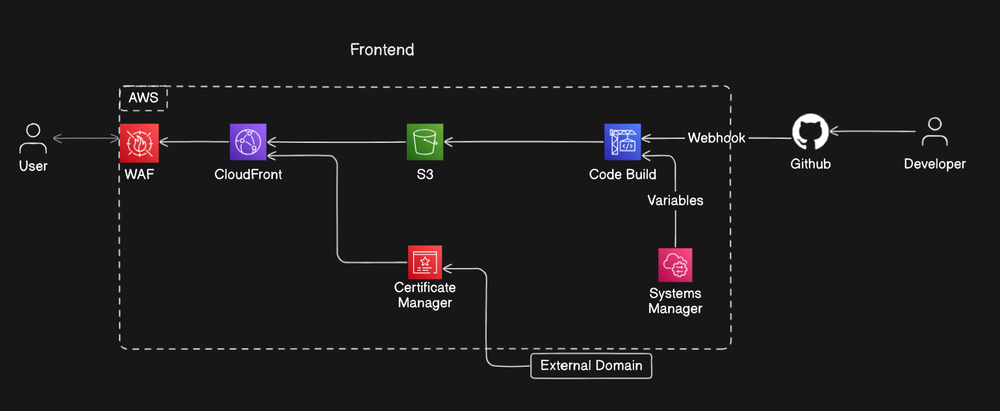
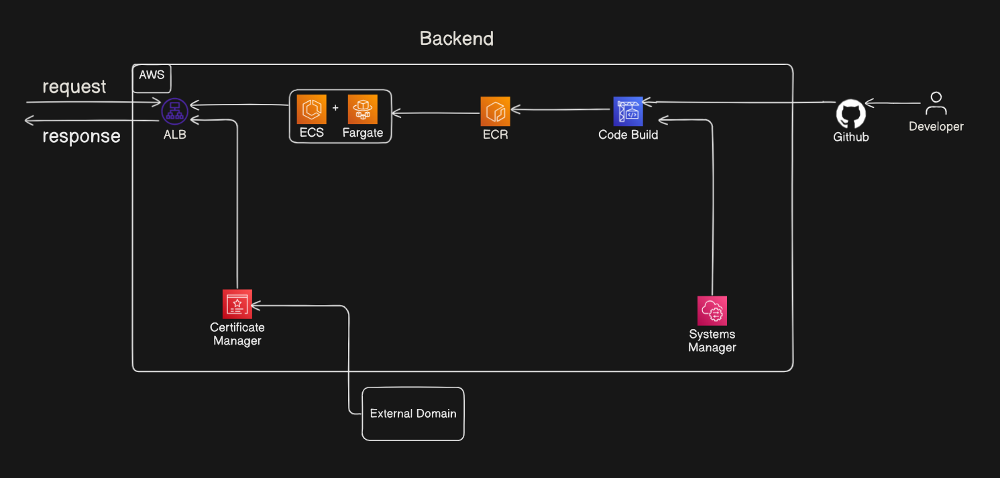

# 📊 AWS FullStack Architecture

This project includes two major components deployed on AWS with CI/CD automation:

- Frontend Application
- Backend Service

---

## 🖼️ Architecture Diagrams

### Frontend Architecture

### Backend Architecture

---

# 🌐 Frontend

This frontend application is deployed on AWS and follows a CI/CD pipeline using GitHub and AWS services.

## 🔧 Components

- **User**: Accesses the frontend via a browser.
- **AWS WAF**: Protects CloudFront from malicious traffic.
- **CloudFront**: Serves static assets with low latency.
- **S3**: Stores frontend assets (HTML, CSS, JS).
- **Certificate Manager**: Manages SSL certificates for HTTPS.
- **CodeBuild**: Builds and deploys the frontend via GitHub webhooks.
- **Systems Manager**: Manages environment variables securely.
- **GitHub**: Triggers builds via webhooks on push events.

## 🌐 Domain

- Uses a custom domain linked via AWS Certificate Manager.

## 🔄 CI/CD Flow

1. Developer pushes code to GitHub.
2. Webhook triggers AWS CodeBuild.
3. CodeBuild pulls secrets from Systems Manager.
4. CodeBuild deploys built assets to S3.
5. CloudFront serves updated content with caching.

---

# ⚙️ Backend

This backend service is deployed using AWS ECS Fargate and utilizes a CI/CD pipeline integrated with GitHub.

## 🔧 Components

- **Developer**: Pushes code to GitHub.
- **GitHub**: Triggers build via webhook.
- **CodeBuild**: Builds Docker image and pushes to ECR.
- **ECR**: Stores container images.
- **ECS + Fargate**: Runs backend containers serverlessly.
- **ALB (Application Load Balancer)**: Routes traffic to ECS services.
- **Certificate Manager**: Provides HTTPS support.
- **Systems Manager**: Stores environment variables securely.

## 🌐 Domain

- Custom domain integrated through Certificate Manager and ALB.

## 🔄 CI/CD Flow

1. Developer commits code to GitHub.
2. Webhook triggers AWS CodeBuild.
3. CodeBuild builds Docker image and pushes to ECR.
4. ECS (via Fargate) pulls latest image from ECR.
5. ALB routes incoming HTTPS requests to ECS service.

---
